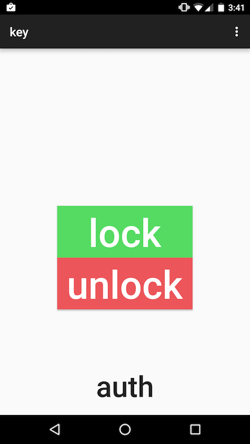

lock
====


Unlock a door wirelessly using your phone.
Uses an Android app to send commands over UDP to and Arduino.

# parts
* Arduino
* Arduino Wi-Fi Shield [1]
* Android phone (firmware 23 or higher)
* Wi-Fi
* Motor (currently set up for 3 wire servo)
[1]
http://www.amazon.com/Arduino-WiFi-Shield/dp/B00MEKEBXG/ref=sr_1_2?ie=UTF8&qid=1456023452&sr=8-2&keywords=arduino+wifi+shield

# building
Arduino wiring

Servo is controlled by pin 9
White	Red	Black
pin 9	5v	gnd

Mount the servo on top of the deadbolt so it can twist it. This is how we did it in the first model.
alternatively, if you want to use the second case (work in progress), which is 3d printed:
* convert case/box.scad to stl
* print using replicatorG

# installation
* Patch your arduino library to use printf if needed (used in current version) using this guide http://playground.arduino.cc/Main/Printf
* open udp/udp.ino in the Ardiuno IDE, change the SSID and password to match yours. upload to Ardiuno.
* Open android app inside android/ folder using Android Studio. upload to phone by clicking the play symbol (for debug) or another way.

# files 
```
android/	android key app
udp/	arduino lock code
info/	presentations etc.
case/	scad file for 3d printed enclosure!
```

# encryption
Working on using AES CBC.

[X] Send random IV

# screenshot


Thanks to Dr. Lin for the guidance and Marcus for the hardware

# todo
* design nice case
* 3d print the case
* status led
* multi user?
* battery

