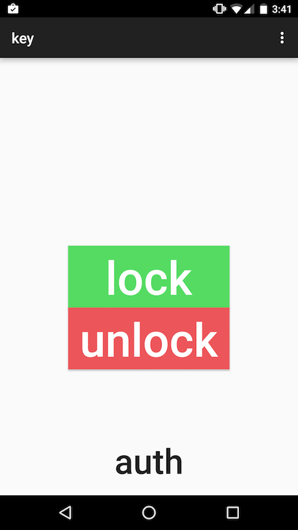

lock
====


Unlock a door wirelessly using your phone.
Uses an Android app to send commands over UDP to and Arduino.

## use
Patch your arduino library to use printf if needed (used in current version) using this guide http://playground.arduino.cc/Main/Printf
Set up servo motor on pin 9.
Upload udp/udp.ino sketch to Arduino with WiFi shield.
Run arduino/ app on phone

## structure
```
android/	android key app
udp/	arduino lock code
info/	presentations etc.
```

# encryption
AES CBC in progress 

[X] Send random IV

# screenshot


Thanks to Dr. Lin for the guidance and Marcus for the hardware

